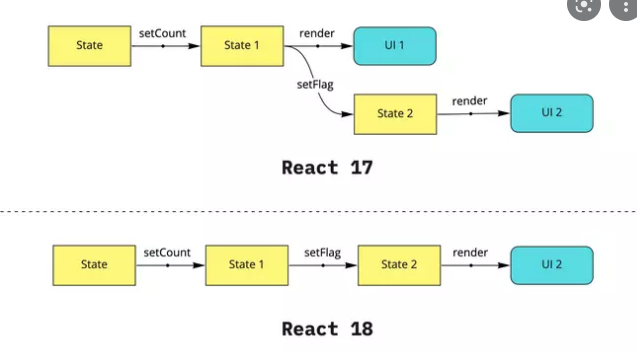

# react-18-workaround
Show how core new features work 🤖

## First inside

<br/>

React 18 provide a new APIs and update the core concept. How:

- Make the process of the re-render easy to control by the `Automatic Batching` concept
- Make the behavior of style coding: combine 2 way -> `functional component` & `class component` work well
- Add new hooks for additional work
- `Suppense` will work more effective


| Kind                           | Expand                                                                                     |
| ------------------------------ |:------------------------------------------------------------------------------------------ |
| `How to update to React 18`    | Click here(#1)                                         |
| `Automatic Batching`           | Click here(#2)                                         |
| `How Func & Class comp work`   |                                          |
| `New hooks`                    |                                          |
| `Suppense`                     | Click here(#3)                                         |
| `StricMode change`             |                                          |
| `Concurrent Features`          |                                          |


<div id="1"></div><br>

## How to update to React 18

- https://reactjs.org/blog/2022/03/08/react-18-upgrade-guide.html
- https://academind.com/tutorials/react-18-update-guide
- https://reactjs.org/docs/react-dom-client.html#reference

```javascript
npm install react@18 react-dom@18

import ReactDOM from 'react-dom'; 
`=>`
import ReactDOM from 'react-dom/client';

ReactDOM.render(<App />, document.getElementById('root'));
`=>`
const root = ReactDOM.createRoot(document.getElementById('root'));
root.render(<App />);
```

<div id="2"></div><br>

## Automatic Batching

- The concept `batching` is present for `group-of-action`. It groups all of the set state for re-render at 1 time.
- `Micro-optimization` are necessary

```javascript
const [count, setCount] = useSate(0)
const [flag, setFlag] = useSate(boolean)

const handleClick = () => {
    setCount(prevState => prevState += 1)
    setFlag(prevState => prevState = true)
}

// React old (<18)
handleClick -> setCount -> re-render -> setFlag -> re-render = 2 re-render

// React 18
handleClick -> setCount -> setFlag -> re-render = 1 re-render

```

<br/>

<div id="3"></div><br>

## Suppense change

- https://github.com/reactjs/rfcs/blob/main/text/0213-suspense-in-react-18.md
- `In React 18, you can start using Suspense for data fetching in opinionated frameworks like Relay, Next.js, Hydrogen, or Remix. Ad hoc data fetching with Suspense is technically possible, but still not recommended as a general strategy.`


